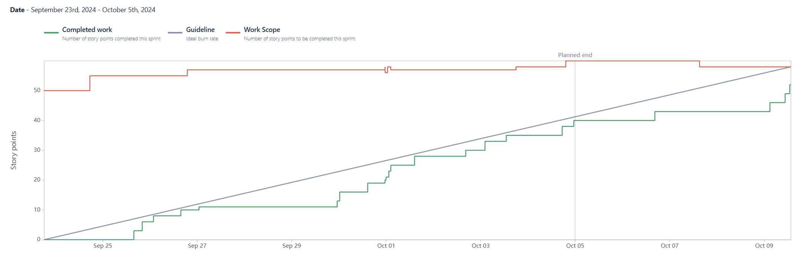
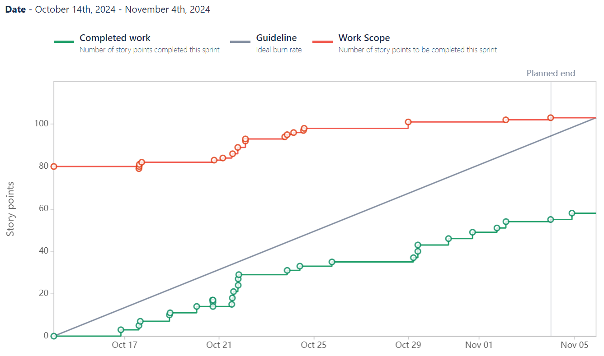

# WeatherLink

This is a **weather app** project created for our software engineering course. Group members include **Ian Lingo**, **Nicholas Esteves**, **Taj Telesford**, **Anthony Rojas**, and **Ethan Perez**. This project's main goal is to have a functional app that tends to all the user's needs while embedding features that enhances the user experience. Our main target audience is anyone who owns a smartphone and/or computer that plans to use a weather app. We believe that the weather apps that currently exist are insightful and visually appealing, but we believe that there are features that are missing that could better inform the user when it comes to the weather. We hope to create an app that people can love and appreciate.

## General Info


## Technologies List

- Javascript (React) -> [What is React?](https://react.dev/)
- Python (Flask) -> [What is Flask?](https://pythonbasics.org/what-is-flask-python/)
- Jira -> [What is Jira?](https://www.atlassian.com/software/jira/guides/getting-started/introduction#what-is-jira-software)
- Bitbucket -> [What is Bitbucket Link?](https://bitbucket.org/product/guides/getting-started/overview#a-brief-overview-of-bitbucket)
- GitKraken -> [What is GitKraken?](https://www.theserverside.com/blog/Coffee-Talk-Java-News-Stories-and-Opinions/GitKraken-tutorial-for-beginners)

## Features

- Basic Landing Page
- Error Handling
- Responsive Design
- Dark/Light Mode
- Loading Indicators
- Weather Data Fetching
- Caching
- City Search Bar
- Geolocation

**Future Features**

- 5-Day Weather Forcast
- Real-time Map with Forecast
- Change Language for Pages
- Clothing Recommendations
- User-Oriented Recommendations

## Sprint 1 (September 23, 2024 - October 5, 2024)

### Contributions

**Ian:**

- **Jira Task CP-42: Set up initial styling for responsiveness**

  - Jira Link: https://cs3398-gorns-f24.atlassian.net/browse/CP-42?atlOrigin=eyJpIjoiMTMzYmUxMTJmMDEyNDVhMTgzYjk1ZTY4OGMzM2U0ZDUiLCJwIjoiaiJ9

- **Jira Task CP-62: Integrate CORS to handle cross-origin requests from the React front-end**

  - Jira Link: https://cs3398-gorns-f24.atlassian.net/browse/CP-62?atlOrigin=eyJpIjoiNGMzNDk5MDU2MDg0NGI5NDhjODZjMmYwMTdiOWNlZDYiLCJwIjoiaiJ9

- **Jira Task CP-48: Implement Route for serving React app in Flask**

  - Jira Link: https://cs3398-gorns-f24.atlassian.net/browse/CP-48?atlOrigin=eyJpIjoiNGJkZWUxYTkzYWJjNDk3YTlmYTYzNGY2N2VhOWExMzMiLCJwIjoiaiJ9

- **Jira Task CP-118: Fine-tune visual details (e.g., spacing, fonts, colors)**

  - Jira Link: https://cs3398-gorns-f24.atlassian.net/browse/CP-118?atlOrigin=eyJpIjoiMWExZDMwMTQ2NDYwNDhjMWE1YzUxMGUxNzkzZjcyYzAiLCJwIjoiaiJ9

- **Jira Task CP-73: Add an option for users to manually input a city if they prefer**

  - Jira Link: https://cs3398-gorns-f24.atlassian.net/browse/CP-73?atlOrigin=eyJpIjoiOGM0OTFjY2VmM2ZkNDAyN2E0NGQ1ZmJkMjQyODhkZDUiLCJwIjoiaiJ9

- **Jira Task CP-55: Optimize the layout for both mobile and desktop users as well as fix city search name ambiguous issue**
  - Jira Link: https://cs3398-gorns-f24.atlassian.net/browse/CP-55?atlOrigin=eyJpIjoiYTQ5ODZmNGYzMzAzNGQ3Njg5NDdmNWI4YzVhNDY2OGIiLCJwIjoiaiJ9

**##############################################################################################**

**Nicholas:**

- **Jira Task CP-71: Automatically fetch weather data based on the user's location when they visit the site.**

  - Jira Link: https://cs3398-gorns-f24.atlassian.net/browse/CP-71?atlOrigin=eyJpIjoiMzU4ZDYzMDRiMDkxNDc3MGE0MzA4NzU1MGJhMDM0OGIiLCJwIjoiaiJ9

- **Jira Task CP-41: Implement basic form submission functionality (but no API calls yet).**

  - Jira Link: https://cs3398-gorns-f24.atlassian.net/browse/CP-41?atlOrigin=eyJpIjoiYjNiNGVlNWNhOTYwNGU5MjhmMDcwYzQ2NzZjZjZjZjYiLCJwIjoiaiJ9

- **Jira Task CP-65: Create unit tests to ensure Flask routes respond correctly.**

  - Jira Link: https://cs3398-gorns-f24.atlassian.net/browse/CP-65?atlOrigin=eyJpIjoiYmY1NTNjNWU4ZTA0NDgzNWE4MzdiMzRjZTdlNGRkMTQiLCJwIjoiaiJ9

- **Jira Task CP-54: Display weather data (e.g., temperature, humidity) in structured React components.**

  - Jira Link: https://cs3398-gorns-f24.atlassian.net/browse/CP-54?atlOrigin=eyJpIjoiN2Q5YTFkNTEzNDc3NDgzMmI3MGRjNmM2ZGMyMDY5OGUiLCJwIjoiaiJ9

- **Jira Task CP-52: Add animations for loading states while fetching weather data.**

  - Jira Link: https://cs3398-gorns-f24.atlassian.net/browse/CP-52?atlOrigin=eyJpIjoiYzFmMThlMWQwMjkwNDUxZjk1ZjFlYzA5YTE4YWEyMTIiLCJwIjoiaiJ9

- **Jira Task CP-135: Update the Flask back-end to fetch real weather data.**

  - Jira Link: https://cs3398-gorns-f24.atlassian.net/browse/CP-135?atlOrigin=eyJpIjoiNTVhNmEyYTJiYTIwNDdiYjlkZWI5Nzk2ZjgzNWQ3NzIiLCJwIjoiaiJ9

- **Jira Task CP-51: Implement a front-end API call using axios or fetch in React to get weather data.**

  - Jira Link: https://cs3398-gorns-f24.atlassian.net/browse/CP-51?atlOrigin=eyJpIjoiZGJlNjlhMDc2NGQ1NDgzMGE4NTgyZTFhOGQzZGZkNjgiLCJwIjoiaiJ9

- **Jira Task CP-57: Add error handling for invalid city names and API request failures.**

- Jira Link: https://cs3398-gorns-f24.atlassian.net/browse/CP-57?atlOrigin=eyJpIjoiYTQ2ODBlZDcyZTZmNDY2MjhlOTVmZDMxM2NiN2IwZDAiLCJwIjoiaiJ9

**##############################################################################################**

**Anthony:**

- **Jira Task CP-40: Create static landing page with input field, header, and footer.**

  - Jira Link: https://cs3398-gorns-f24.atlassian.net/browse/CP-40

- **Jira Task CP-61: Set up flask and /weather route with a placeholder response for weather data.**

  - Jira Link: https://cs3398-gorns-f24.atlassian.net/browse/CP-61

- **Jira Task CP-58: Implement a dark/light theme toggle for user preference.**

  - Jira Link: https://cs3398-gorns-f24.atlassian.net/browse/CP-58

- **Jira Task CP-46: Modify the Flask /weather route to fetch data from the API.**

  - Jira Link: https://cs3398-gorns-f24.atlassian.net/browse/CP-46

**##############################################################################################**

### Reports



### Next Steps (for Sprint 2)

_Note: Specific roles are not delegated yet as of October 9, 2024_

**User Story 6:** Add Weather Forecast As a user, I would like to see a 5-day weather forecast so that I can plan ahead based on future weather conditions.

**User Story 7:** Add UV Index As a user, I would like the UV index so that I can make informed decisions about sun exposure and protect my skin from harmful ultraviolet radiation

**User Story 8:** Add Loading Indicators and Feedback As a user, I would like to see a loading spinner while data is being fetched so that I know the app is processing my request

**User Story 9:** Cache Weather Data As a user, I would like the app to cache previously fetched weather data so that I don’t have to wait for a new API request when searching for the same city multiple times

**User Story 10:** Improve Error Handling and User Experience As a user, I would like the app to provide clear and helpful error messages when something goes wrong so that I understand what happened and how to fix it

## Sprint 2 (October 13, 2024 - November 3, 2024)

### Contributions

**Ian:**

- **Jira Task SCRUM-138: Refactor API calls (for weather, geolocation, UV index) into a dedicated service file (weatherService.js or apiService.js), making the logic reusable across multiple components.**

  - Jira Link: https://cs3398-gorns-fall24.atlassian.net/jira/software/projects/SCRUM/boards/1?selectedIssue=SCRUM-138

    - Bitbucket Commits:
      - https://bitbucket.org/cs3398-gorns-f24/%7B967422e6-c3bf-46a5-b616-e8b98bad8dbc%7D/commits/aea3e922d93fbed7a69c179657125e6c102cf936
      - https://bitbucket.org/cs3398-gorns-f24/%7B967422e6-c3bf-46a5-b616-e8b98bad8dbc%7D/commits/ce77d4b7743b815a2f1ddb833c2af9107196be3f

- **Jira Task SCRUM-123: Implement map markers and weather data fetching.**

  - Jira Link: https://cs3398-gorns-fall24.atlassian.net/jira/software/projects/SCRUM/boards/1?selectedIssue=SCRUM-123

    - Bitbucket Commits:
      - https://bitbucket.org/cs3398-gorns-f24/%7B967422e6-c3bf-46a5-b616-e8b98bad8dbc%7D/commits/aad201ea7a1fd5d7ee88a249d0aa86f84e4890ca
      - https://bitbucket.org/cs3398-gorns-f24/%7B967422e6-c3bf-46a5-b616-e8b98bad8dbc%7D/commits/5ac0571a39b833d2708243f0d3c341d40b0d483a

- **Jira Task SCRUM-124: Refine and test dynamic map interactions UI/UX.**

  - Jira Link: https://cs3398-gorns-fall24.atlassian.net/jira/software/projects/SCRUM/boards/1?selectedIssue=SCRUM-124

    - Bitbucket Commits:
      - https://bitbucket.org/cs3398-gorns-f24/%7B967422e6-c3bf-46a5-b616-e8b98bad8dbc%7D/commits/6541ac0ddd117442171bc64132e4139e643348de
      - https://bitbucket.org/cs3398-gorns-f24/%7B967422e6-c3bf-46a5-b616-e8b98bad8dbc%7D/commits/85f2b25dae9e812da0764942ecf0557de71f9261
      - https://bitbucket.org/cs3398-gorns-f24/%7B967422e6-c3bf-46a5-b616-e8b98bad8dbc%7D/commits/5973fe24fb6b22e19b8349e60d7eead5ea4a2404

- **Jira Task SCRUM-79: Implement map features (temp, wind, pop-ups, etc.) with real-time updates for when weather conditions change.**

  - Jira Link: https://cs3398-gorns-fall24.atlassian.net/jira/software/projects/SCRUM/boards/1?selectedIssue=SCRUM-79

    - Bitbucket Commits:
      - https://bitbucket.org/cs3398-gorns-f24/%7B967422e6-c3bf-46a5-b616-e8b98bad8dbc%7D/commits/bde4a1eee12574b522929339b048076e7569fc76
      - https://bitbucket.org/cs3398-gorns-f24/%7B967422e6-c3bf-46a5-b616-e8b98bad8dbc%7D/commits/53be868f9fb8057f7848c774932731e0e82e1dd7
      - https://bitbucket.org/cs3398-gorns-f24/%7B967422e6-c3bf-46a5-b616-e8b98bad8dbc%7D/commits/0af3a1f61bc76c9998105402a334b218519844c0
      - https://bitbucket.org/cs3398-gorns-f24/%7B967422e6-c3bf-46a5-b616-e8b98bad8dbc%7D/commits/7ba35b2a835d47e293dab2de9b2d680ddf2d4b5f

- **Jira Task SCRUM-78: Fix and test all toggle/data features (UV Index, Air Quality, etc).**

  - Jira Link: https://cs3398-gorns-fall24.atlassian.net/jira/software/projects/SCRUM/boards/1?selectedIssue=SCRUM-78

    - Bitbucket Commits:
      - https://bitbucket.org/cs3398-gorns-f24/%7B967422e6-c3bf-46a5-b616-e8b98bad8dbc%7D/commits/60a5b407014cc44821def7a57f6f61c9ecc73524
      - https://bitbucket.org/cs3398-gorns-f24/%7B967422e6-c3bf-46a5-b616-e8b98bad8dbc%7D/commits/f1aa12ee0b0f98d7867e17e6e76d6547b9583039

- **Jira Task SCRUM-56: Modify interactive map to fit within same component as current weather and forecast data display.**

  - Jira Link: https://cs3398-gorns-fall24.atlassian.net/jira/software/projects/SCRUM/boards/1?selectedIssue=SCRUM-56

    - Bitbucket Commits:
      - https://bitbucket.org/cs3398-gorns-f24/%7B967422e6-c3bf-46a5-b616-e8b98bad8dbc%7D/commits/450618606235e5cc9d88ed1b03a3c8a53aba31a2
      - https://bitbucket.org/cs3398-gorns-f24/%7B967422e6-c3bf-46a5-b616-e8b98bad8dbc%7D/commits/d1efd6f9f57901fcf01c5785b1c352bfb2a5fad8
      - https://bitbucket.org/cs3398-gorns-f24/%7B967422e6-c3bf-46a5-b616-e8b98bad8dbc%7D/commits/de4beea930ace78bd0324b9d45777d3eae7e0308
      - https://bitbucket.org/cs3398-gorns-f24/%7B967422e6-c3bf-46a5-b616-e8b98bad8dbc%7D/commits/29821c03b5dd5e22c8d9cfed831f267e5f3ff91f
      - https://bitbucket.org/cs3398-gorns-f24/%7B967422e6-c3bf-46a5-b616-e8b98bad8dbc%7D/commits/38bf17f02ee28175ccdc6d8f71d1b9d8bfa0caa5
      - https://bitbucket.org/cs3398-gorns-f24/%7B967422e6-c3bf-46a5-b616-e8b98bad8dbc%7D/commits/ebaa1f1c456486a575d309d503e9add7150de001

**##############################################################################################**

**Anthony:**

- **Jira Task SCRUM-140: Break down some components (e.g., App.jsx) into smaller, reusable components.**

  - Jira Link: https://cs3398-gorns-fall24.atlassian.net/browse/SCRUM-140

- **Jira Task SCRUM-100: install i18next dependencies and configure i18next file**

  - Jira Link: https://cs3398-gorns-fall24.atlassian.net/browse/SCRUM-100

- **Jira Task SCRUM-99: Set up DeepL API in the backend**

  - Jira Link: https://cs3398-gorns-fall24.atlassian.net/browse/SCRUM-99

- **Jira Task SCRUM-97: Configure all front-end files to apply translation**

  - Jira Link: https://cs3398-gorns-fall24.atlassian.net/browse/SCRUM-97

- **Jira Task SCRUM-97: Implement language selection (e.g., English, Spanish, French) in the settings or header.**

  - Jira Link: https://cs3398-gorns-fall24.atlassian.net/browse/SCRUM-96

**##############################################################################################**

**Nicholas:**

- **Jira Task SCRUM-142: API-integration for feedback form**

  - Jira Link: https://cs3398-gorns-fall24.atlassian.net/browse/SCRUM-142?atlOrigin=eyJpIjoiNWMwODFjMjU5NzkwNGQ1Nzg4YjQxODcyNDM3ZDRlOTUiLCJwIjoiaiJ9

- **Jira Task SCRUM-136: Folder rescruture, organizes components, services, and utilities in a scalable manner.**

  - Jira Link: https://cs3398-gorns-fall24.atlassian.net/browse/SCRUM-139?atlOrigin=eyJpIjoiMjczMTYyZTk1NjgzNGRiYzlkZDI3YzMzZDUxZDU2ZjciLCJwIjoiaiJ9

- **Jira SCRUM-25: Create feedback form automation**

  - Jira Link: https://cs3398-gorns-fall24.atlassian.net/browse/SCRUM-143?atlOrigin=eyJpIjoiNzhhZmJjZmVkNzQ1NDRhZmJhOGExMTVkNDJhOGJlMTciLCJwIjoiaiJ9

- **Jira SCRUM-145: Implement Success and Error Messages for Feedback Submission**

  - Jira Link: https://cs3398-gorns-fall24.atlassian.net/browse/SCRUM-145?atlOrigin=eyJpIjoiYTkzNTE2ODJjYjE1NDU4YzliZWQwYTRhODAxNDhjYTMiLCJwIjoiaiJ9

**##############################################################################################**

### Reports



### Next Steps (for Sprint 2)

_Note: Specific roles are not delegated yet as of November 5, 2024_

**User Story 14:** Add Historical Weather Data As a user, I would like historical weather data so that I can analyze past weather patterns, compare previous conditions to the current forecast, and plan future activities based on trends.

**User Story 15:** Deploy the App and Monitor Performance As a developer, I would like to deploy the app and monitor its performance so that I can ensure it runs smoothly in production.

**User Story 16:** Add Clothing Suggestion As a user, I would like clothing suggestions so that I can dress appropriately for the weather conditions and stay comfortable throughout the day.

**Note:** More Stories will be added. Stay tuned.

## Sprint 3 (November 11, 2024 - November 28, 2024)

### Contributions

**Ian:**

- **Jira Task SCRUM-151: Modify UI/UX components of the Main page.**

  - Jira Link: https://cs3398-gorns-fall24.atlassian.net/jira/software/projects/SCRUM/boards/1?selectedIssue=SCRUM-151

    - Bitbucket Commits:
      - https://bitbucket.org/cs3398-gorns-f24/%7B967422e6-c3bf-46a5-b616-e8b98bad8dbc%7D/commits/b5e87a64db1b6c79047e5ce1b0520a559ee4792f
      - https://bitbucket.org/cs3398-gorns-f24/%7B967422e6-c3bf-46a5-b616-e8b98bad8dbc%7D/commits/b6be4aaaf6c9301940c1ea8201129d93b40e769b

- **Jira Task SCRUM-149: Integrate Basic ML Model.**

  - Jira Link: https://cs3398-gorns-fall24.atlassian.net/jira/software/projects/SCRUM/boards/1?selectedIssue=SCRUM-149

    - Bitbucket Commits:
      - https://bitbucket.org/cs3398-gorns-f24/%7B967422e6-c3bf-46a5-b616-e8b98bad8dbc%7D/commits/68692fb586a30868e5f014e2c4542085e5437719
      - https://bitbucket.org/cs3398-gorns-f24/%7B967422e6-c3bf-46a5-b616-e8b98bad8dbc%7D/commits/dc13992dc3f7b67d4b8d7ae16a6db144b26cb8f1
      - https://bitbucket.org/cs3398-gorns-f24/%7B967422e6-c3bf-46a5-b616-e8b98bad8dbc%7D/commits/b45d886e6201429fbb203ade14745be8298652ab
      - https://bitbucket.org/cs3398-gorns-f24/%7B967422e6-c3bf-46a5-b616-e8b98bad8dbc%7D/commits/d7737fc4adf235b1b11d84a4f2fed58b85342e30

- **Jira Task SCRUM-148: Update UI/UX of the Tailored Advice page.**

  - Jira Link: https://cs3398-gorns-fall24.atlassian.net/jira/software/projects/SCRUM/boards/1?selectedIssue=SCRUM-148

    - Bitbucket Commits:
      - https://bitbucket.org/cs3398-gorns-f24/%7B967422e6-c3bf-46a5-b616-e8b98bad8dbc%7D/commits/8965156e035318eb447380c1344c8ea6b8e39142
      - https://bitbucket.org/cs3398-gorns-f24/%7B967422e6-c3bf-46a5-b616-e8b98bad8dbc%7D/commits/9c1a8eef20f15bac1e80d062e44a4ba01e1c78f5

- **Jira Task SCRUM-129: Save weather data through caching.**

  - Jira Link: https://cs3398-gorns-fall24.atlassian.net/jira/software/projects/SCRUM/boards/1?selectedIssue=SCRUM-129

    - Bitbucket Commits:
      - https://bitbucket.org/cs3398-gorns-f24/%7B967422e6-c3bf-46a5-b616-e8b98bad8dbc%7D/commits/df425bc3daee1060a528d85f66fe15cb8c468687
      - https://bitbucket.org/cs3398-gorns-f24/%7B967422e6-c3bf-46a5-b616-e8b98bad8dbc%7D/commits/c0f13e7c6aa0bfef67261498b41444b14eae2414
      - https://bitbucket.org/cs3398-gorns-f24/%7B967422e6-c3bf-46a5-b616-e8b98bad8dbc%7D/commits/bf95405fc28a370420a0f4e23e282151360ee609
      - https://bitbucket.org/cs3398-gorns-f24/%7B967422e6-c3bf-46a5-b616-e8b98bad8dbc%7D/commits/389f696ca05b72e8ec8d08db79c692a834383535

- **Jira Task SCRUM-152: Conduct ML Model Testing and Refinement.**

  - Jira Link: https://cs3398-gorns-fall24.atlassian.net/jira/software/projects/SCRUM/boards/1?selectedIssue=SCRUM-152

    - Bitbucket Commits:
      - https://bitbucket.org/cs3398-gorns-f24/%7B967422e6-c3bf-46a5-b616-e8b98bad8dbc%7D/commits/42fb6e3806d6919892b85138971d67be78d28ad3
      - https://bitbucket.org/cs3398-gorns-f24/%7B967422e6-c3bf-46a5-b616-e8b98bad8dbc%7D/commits/7e7e92378cc38e615cc1a07489e3095166de1c28
      - https://bitbucket.org/cs3398-gorns-f24/%7B967422e6-c3bf-46a5-b616-e8b98bad8dbc%7D/commits/3f6eed263ca4d33b3be98bf20b77c22c4ee45325

- **Jira Task SCRUM-147: Enhance Tailored Advice Page and Features.**

  - Jira Link: https://cs3398-gorns-fall24.atlassian.net/jira/software/projects/SCRUM/boards/1?selectedIssue=SCRUM-147

    - Bitbucket Commits:
      - https://bitbucket.org/cs3398-gorns-f24/%7B967422e6-c3bf-46a5-b616-e8b98bad8dbc%7D/commits/bf5d1e350c3642c1ca6aaa3eebc34837dd72dc1c
      - https://bitbucket.org/cs3398-gorns-f24/%7B967422e6-c3bf-46a5-b616-e8b98bad8dbc%7D/commits/5848695833f125a11a03aaf760be34eeace49e16

- **Jira Task SCRUM-150: Modify responsiveness of all components.**

  - Jira Link: https://cs3398-gorns-fall24.atlassian.net/jira/software/projects/SCRUM/boards/1?selectedIssue=SCRUM-150

    - Bitbucket Commits:
      - https://bitbucket.org/cs3398-gorns-f24/%7B967422e6-c3bf-46a5-b616-e8b98bad8dbc%7D/commits/ea037645ef15faa8ca2f6357896b674fa741724c
      - https://bitbucket.org/cs3398-gorns-f24/%7B967422e6-c3bf-46a5-b616-e8b98bad8dbc%7D/commits/0f14d240010d6150636d0347eafdcfd91814134d

**##############################################################################################**

**Nick:**

- **Jira Task SCRUM-163: Integrate new features into deployment.**

  - Jira Link: https://cs3398-gorns-fall24.atlassian.net/jira/software/projects/SCRUM/boards/1?selectedIssue=SCRUM-163

    - Bitbucket Commits:
      - https://bitbucket.org/cs3398-gorns-f24/%7B967422e6-c3bf-46a5-b616-e8b98bad8dbc%7D/commits/21f381bea349ca75e58f93dfc8cc73c845bd68d2
      - https://bitbucket.org/cs3398-gorns-f24/%7B967422e6-c3bf-46a5-b616-e8b98bad8dbc%7D/commits/60d898c6bc8bfde56def7fe8051c189592da0b32
      - https://bitbucket.org/cs3398-gorns-f24/%7B967422e6-c3bf-46a5-b616-e8b98bad8dbc%7D/commits/fc8e2b78866d59d3b171aefcad5fdafe15e7986d
      - https://bitbucket.org/cs3398-gorns-f24/%7B967422e6-c3bf-46a5-b616-e8b98bad8dbc%7D/commits/d11f01c13243ea704c10f8ab69469ce8c4ade891

- **Jira Task SCRUM-112: Create Day/Night Background.**

  - Jira Link: https://cs3398-gorns-fall24.atlassian.net/jira/software/projects/SCRUM/boards/1?selectedIssue=SCRUM-112

    - Bitbucket Commits:
      - https://bitbucket.org/cs3398-gorns-f24/%7B967422e6-c3bf-46a5-b616-e8b98bad8dbc%7D/commits/290fdf4d8cdf09003a98fb28ecf7000c02b4b4e8
      - https://bitbucket.org/cs3398-gorns-f24/%7B967422e6-c3bf-46a5-b616-e8b98bad8dbc%7D/commits/281d8e31c5a7bcfd182bde95f390c51b9a458633
      - https://bitbucket.org/cs3398-gorns-f24/%7B967422e6-c3bf-46a5-b616-e8b98bad8dbc%7D/commits/c63382a46a279d32aeb49332dbbbc4d4d73d1116
      - https://bitbucket.org/cs3398-gorns-f24/%7B967422e6-c3bf-46a5-b616-e8b98bad8dbc%7D/commits/714d88d88431b40d9dc9643bfcf1ddbe78cfb70e

- **Jira Task SCRUM-70: Set Up Firebase Hosting for Production Deployment.**

  - Jira Link: https://cs3398-gorns-fall24.atlassian.net/jira/software/projects/SCRUM/boards/1?selectedIssue=SCRUM-70

    - Bitbucket Commits:
      - https://bitbucket.org/cs3398-gorns-f24/%7B967422e6-c3bf-46a5-b616-e8b98bad8dbc%7D/commits/6309cd59dd167af481311dd21f61909ca7e675a1
      - https://bitbucket.org/cs3398-gorns-f24/%7B967422e6-c3bf-46a5-b616-e8b98bad8dbc%7D/commits/1b36c6ee1c53ed5b31abdddba59e54fee91cddf4
      - https://bitbucket.org/cs3398-gorns-f24/%7B967422e6-c3bf-46a5-b616-e8b98bad8dbc%7D/commits/dc1988ca1e8b65e2d3783e08cd6870b2b009af3a
      - https://bitbucket.org/cs3398-gorns-f24/%7B967422e6-c3bf-46a5-b616-e8b98bad8dbc%7D/commits/0812327c5cc252170a609ce757b48c454947df1e

- **Jira Task SCRUM-64: Integrate other API's into back-end, map, OpenAI, translator, feedback form, etc.**

  - Jira Link: https://cs3398-gorns-fall24.atlassian.net/jira/software/projects/SCRUM/boards/1?selectedIssue=SCRUM-64

    - Bitbucket Commits:
      - https://bitbucket.org/cs3398-gorns-f24/%7B967422e6-c3bf-46a5-b616-e8b98bad8dbc%7D/commits/d92e306f209e0e277872697a6a9cee9358d6c7dd
      - https://bitbucket.org/cs3398-gorns-f24/%7B967422e6-c3bf-46a5-b616-e8b98bad8dbc%7D/commits/00cbfc0f28f6fef619bb9b4270b03dd2f0ec2d98
      - https://bitbucket.org/cs3398-gorns-f24/%7B967422e6-c3bf-46a5-b616-e8b98bad8dbc%7D/commits/8fbdc92cd7d69c28e7ec335e95055991e4e04f32
      - https://bitbucket.org/cs3398-gorns-f24/%7B967422e6-c3bf-46a5-b616-e8b98bad8dbc%7D/commits/48fa23a5347fd3201a7106505f6bf1115a727413

- **Jira Task SCRUM-171: Set Up Render Hosting for Back-End API Fetch.**

  - Jira Link: https://cs3398-gorns-fall24.atlassian.net/jira/software/projects/SCRUM/boards/1?selectedIssue=SCRUM-171

    - Bitbucket Commits:
      - https://bitbucket.org/cs3398-gorns-f24/%7B967422e6-c3bf-46a5-b616-e8b98bad8dbc%7D/commits/1e0570a67c266c120bd10309360ee54626e14504
      - https://bitbucket.org/cs3398-gorns-f24/%7B967422e6-c3bf-46a5-b616-e8b98bad8dbc%7D/commits/cf9ee3ce29cd00709b12a306c89eb527d0f4dfa6
      - https://bitbucket.org/cs3398-gorns-f24/%7B967422e6-c3bf-46a5-b616-e8b98bad8dbc%7D/commits/59cb26b05554411a0c581fb6fa53a0d20dec7373
      - https://bitbucket.org/cs3398-gorns-f24/%7B967422e6-c3bf-46a5-b616-e8b98bad8dbc%7D/commits/0ac60b6977d872aa09016a4990045e21567c702e

- **Jira Task SCRUM-68: Integrate Translation function to deployment.**

  - Jira Link: https://cs3398-gorns-fall24.atlassian.net/jira/software/projects/SCRUM/boards/1?selectedIssue=SCRUM-68

    - Bitbucket Commits:
      - https://bitbucket.org/cs3398-gorns-f24/%7B967422e6-c3bf-46a5-b616-e8b98bad8dbc%7D/commits/0e05f7662a201125636ae76ec14e05db01175d6a
      - https://bitbucket.org/cs3398-gorns-f24/%7B967422e6-c3bf-46a5-b616-e8b98bad8dbc%7D/commits/b72a308855ebfab20e5ea2af3357a600ca28480a
      - https://bitbucket.org/cs3398-gorns-f24/%7B967422e6-c3bf-46a5-b616-e8b98bad8dbc%7D/commits/5885f76d0ef2deba5f2669423f11dc27c48ffd92
      - https://bitbucket.org/cs3398-gorns-f24/%7B967422e6-c3bf-46a5-b616-e8b98bad8dbc%7D/commits/5913157de0ecd4c73895c4c5d481b6e547c971b9

**##############################################################################################**

**Anthony:**

- **Jira Task SCRUM-155: Style the News page.**

  - Jira Link: https://cs3398-gorns-fall24.atlassian.net/jira/software/projects/SCRUM/boards/1?selectedIssue=SCRUM-155

    - Bitbucket Commits:
      - https://bitbucket.org/cs3398-gorns-f24/%7B967422e6-c3bf-46a5-b616-e8b98bad8dbc%7D/commits/56155c011efcfd5fa6e66dd2c74151f04ec036a5
      - https://bitbucket.org/cs3398-gorns-f24/%7B967422e6-c3bf-46a5-b616-e8b98bad8dbc%7D/commits/1de862e09f6dc9fb20dadb2719299c709e733c74

- **Jira Task SCRUM-156: Create front end fetch request for news API.**

  - Jira Link: https://cs3398-gorns-fall24.atlassian.net/jira/software/projects/SCRUM/boards/1?selectedIssue=SCRUM-156

    - Bitbucket Commits:
      - https://bitbucket.org/cs3398-gorns-f24/%7B967422e6-c3bf-46a5-b616-e8b98bad8dbc%7D/commits/ffb6f6906e875d3a3d2848bda1b13ada48146304
      - https://bitbucket.org/cs3398-gorns-f24/%7B967422e6-c3bf-46a5-b616-e8b98bad8dbc%7D/commits/5762d5700edbe6fdfbb454c71eb5b77071e619ba

- **Jira Task SCRUM-157: Parse through news API and serve the data to the front end.**

  - Jira Link: https://cs3398-gorns-fall24.atlassian.net/jira/software/projects/SCRUM/boards/1?selectedIssue=SCRUM-157

    - Bitbucket Commits:
      - https://bitbucket.org/cs3398-gorns-f24/%7B967422e6-c3bf-46a5-b616-e8b98bad8dbc%7D/commits/f271058763a6dfdd25a4fb5f84026cd2d5ad4997
      - https://bitbucket.org/cs3398-gorns-f24/%7B967422e6-c3bf-46a5-b616-e8b98bad8dbc%7D/commits/e2f127705e0671acb37f214f42d925506bb807d4

- **Jira Task SCRUM-154: Create a News link in the nav bar that directs users to a new page.**

  - Jira Link: https://cs3398-gorns-fall24.atlassian.net/jira/software/projects/SCRUM/boards/1?selectedIssue=SCRUM-154

    - Bitbucket Commits:
      - https://bitbucket.org/cs3398-gorns-f24/%7B967422e6-c3bf-46a5-b616-e8b98bad8dbc%7D/commits/f3282beb5536ac7947fcbfcf10dfff0a1ae13912
      - https://bitbucket.org/cs3398-gorns-f24/%7B967422e6-c3bf-46a5-b616-e8b98bad8dbc%7D/commits/fe7fdf8d323f3191f5cfb58165a50d78c5cd7763
      - https://bitbucket.org/cs3398-gorns-f24/%7B967422e6-c3bf-46a5-b616-e8b98bad8dbc%7D/commits/5ab69fffa5dda3ffe1a78ae80ce3b2a2349cd003
      - https://bitbucket.org/cs3398-gorns-f24/%7B967422e6-c3bf-46a5-b616-e8b98bad8dbc%7D/commits/21fad3ac06da9972cd18d5041d092c6e9c4096fe

- **Jira Task SCRUM-159: Make the contact link direct the users to a new page.**

  - Jira Link: https://cs3398-gorns-fall24.atlassian.net/jira/software/projects/SCRUM/boards/1?selectedIssue=SCRUM-159

    - Bitbucket Commits:
      - https://bitbucket.org/cs3398-gorns-f24/%7B967422e6-c3bf-46a5-b616-e8b98bad8dbc%7D/commits/987dd72e463b4d594079ce931b6836315aad28f4
      - https://bitbucket.org/cs3398-gorns-f24/%7B967422e6-c3bf-46a5-b616-e8b98bad8dbc%7D/commits/ae5dd1d29d8b46252dde2acfe233375dba3e7ef3
      - https://bitbucket.org/cs3398-gorns-f24/%7B967422e6-c3bf-46a5-b616-e8b98bad8dbc%7D/commits/2aa5ecdbf765f8ae6577b26e526a765feb42c0d2
      - https://bitbucket.org/cs3398-gorns-f24/%7B967422e6-c3bf-46a5-b616-e8b98bad8dbc%7D/commits/2cb1b37a7010422abd22b6e6130e60965554e735

- **Jira Task SCRUM-160: Style the contact page.**

  - Jira Link: https://cs3398-gorns-fall24.atlassian.net/jira/software/projects/SCRUM/boards/1?selectedIssue=SCRUM-160

    - Bitbucket Commits:
      - https://bitbucket.org/cs3398-gorns-f24/%7B967422e6-c3bf-46a5-b616-e8b98bad8dbc%7D/commits/1e0f652087dc98319a9497130ac587e11a570c09

- **Jira Task SCRUM-162: Create an about section in the contact page.**

  - Jira Link: https://cs3398-gorns-fall24.atlassian.net/jira/software/projects/SCRUM/boards/1?selectedIssue=SCRUM-162

    - Bitbucket Commits:
      - https://bitbucket.org/cs3398-gorns-f24/%7B967422e6-c3bf-46a5-b616-e8b98bad8dbc%7D/commits/8397025bda4bef9027f56864095706da3b3f5bf8
      - https://bitbucket.org/cs3398-gorns-f24/%7B967422e6-c3bf-46a5-b616-e8b98bad8dbc%7D/commits/d4ea51a31191440722600cdf18ac0c853a8d7817

- **Jira Task SCRUM-161: Have the contact page display the groups contact info (and maybe pictures).**

  - Jira Link: https://cs3398-gorns-fall24.atlassian.net/jira/software/projects/SCRUM/boards/1?selectedIssue=SCRUM-161

    - Bitbucket Commits:
      - https://bitbucket.org/cs3398-gorns-f24/%7B967422e6-c3bf-46a5-b616-e8b98bad8dbc%7D/commits/5bf5a256a886a5f2b80dcc37fea98ea025b072f1

**##############################################################################################**

**Ethan:**

- **Jira Task SCRUM-168: Add Frontend Logic to Fetch and Display Recent Cities on Load.**

  - Jira Link: https://cs3398-gorns-fall24.atlassian.net/jira/software/projects/SCRUM/boards/1?selectedIssue=SCRUM-168

    - Bitbucket Commits:
      - https://bitbucket.org/cs3398-gorns-f24/%7B967422e6-c3bf-46a5-b616-e8b98bad8dbc%7D/commits/c982e9754b1ea598f650551f6169d5933db59369
      - https://bitbucket.org/cs3398-gorns-f24/%7B967422e6-c3bf-46a5-b616-e8b98bad8dbc%7D/commits/ef757e22ac36d30af01098c806988e2823a01a89
      - https://bitbucket.org/cs3398-gorns-f24/%7B967422e6-c3bf-46a5-b616-e8b98bad8dbc%7D/commits/7a3934acb66baf93f7ed66ad9306271575a73ef3
      - https://bitbucket.org/cs3398-gorns-f24/%7B967422e6-c3bf-46a5-b616-e8b98bad8dbc%7D/commits/1d45dbf59539e92c9006715bf1430522b0de9bc9

- **Jira Task SCRUM-166: Design a UI Component for History and Saved Cities List.**

  - Jira Link: https://cs3398-gorns-fall24.atlassian.net/jira/software/projects/SCRUM/boards/1?selectedIssue=SCRUM-166

    - Bitbucket Commits:
      - https://bitbucket.org/cs3398-gorns-f24/%7B967422e6-c3bf-46a5-b616-e8b98bad8dbc%7D/commits/0fe50231ee7ca15033e095a1d8c19b03202b5d6e
      - https://bitbucket.org/cs3398-gorns-f24/%7B967422e6-c3bf-46a5-b616-e8b98bad8dbc%7D/commits/ced01e27a9050633e64891fb2a50c47f6010b470
      - https://bitbucket.org/cs3398-gorns-f24/%7B967422e6-c3bf-46a5-b616-e8b98bad8dbc%7D/commits/858a4cd8ac434d00b684d0ee410d46173fd32f5a
      - https://bitbucket.org/cs3398-gorns-f24/%7B967422e6-c3bf-46a5-b616-e8b98bad8dbc%7D/commits/4efbffc9a6d4af4c7e92758f11152cc60a2411db

- **Jira Task SCRUM-114: Add push notifications for users who allow notifications (for web apps).**

  - Jira Link: https://cs3398-gorns-fall24.atlassian.net/jira/software/projects/SCRUM/boards/1?selectedIssue=SCRUM-114

    - Bitbucket Commits:
      - https://bitbucket.org/cs3398-gorns-f24/%7B967422e6-c3bf-46a5-b616-e8b98bad8dbc%7D/commits/6f2a1e09c3c7be9d8ff3d0b7e6d19f122b9807d9
      - https://bitbucket.org/cs3398-gorns-f24/%7B967422e6-c3bf-46a5-b616-e8b98bad8dbc%7D/commits/6c9323d48d6d822a97438624393e10f1b2c6ef4f
      - https://bitbucket.org/cs3398-gorns-f24/%7B967422e6-c3bf-46a5-b616-e8b98bad8dbc%7D/commits/d33494f8e5a6e89d99120a25a78cffa59e74fcb5
      - https://bitbucket.org/cs3398-gorns-f24/%7B967422e6-c3bf-46a5-b616-e8b98bad8dbc%7D/commits/29458bf805a6d829b9fd7a159d468909c7f8807b

- **Jira Task SCRUM-170: Set Up API and Backend Endpoint for Saving/Fetching City History.**

  - Jira Link: https://cs3398-gorns-fall24.atlassian.net/jira/software/projects/SCRUM/boards/1?selectedIssue=SCRUM-170

    - Bitbucket Commits:
      - https://bitbucket.org/cs3398-gorns-f24/%7B967422e6-c3bf-46a5-b616-e8b98bad8dbc%7D/commits/7b91d65f571e9f2cd8c35b164921b294cf7ea66d
      - https://bitbucket.org/cs3398-gorns-f24/%7B967422e6-c3bf-46a5-b616-e8b98bad8dbc%7D/commits/5f66454295ac3a7160c6e39084d89e37f71a66e3
      - https://bitbucket.org/cs3398-gorns-f24/%7B967422e6-c3bf-46a5-b616-e8b98bad8dbc%7D/commits/f2249c6c0e3daaeaf80a7d12e2076f0bbf1e8447
      - https://bitbucket.org/cs3398-gorns-f24/%7B967422e6-c3bf-46a5-b616-e8b98bad8dbc%7D/commits/2b234191fcc74beebfcec47e24795b939c2c9d92

**##############################################################################################**

### Reports


## Project Setup Instructions

_Note: The program runs on the **Development Branch**. Please use this branch for **demoing**._

### Step 1: Download Project Dependencies

1. **Clone the repository**:

   ```bash
   git clone <repository-url>
   cd <repository-directory>
   ```

2. **Install Python**:
   Make sure Python is installed on your system. Check by running:
   ```bash
   python --version
   ```
   If Python is not installed, download and install it from [python.org](https://www.python.org/).

### Step 2: Set Up the Python Backend Environment

1. **Create a virtual environment**:
   This isolates your Python environment so that dependencies are kept separate.

   ```bash
   python -m venv venv
   ```

2. **Activate the virtual environment**:

   - **Windows**:
     ```bash
     venv\Scripts\activate
     ```
   - **MacOS/Linux**:
     ```bash
     source venv/bin/activate
     ```

3. **Install backend dependencies**:
   With the virtual environment activated, install the necessary Python packages.
   ```bash
   pip install -r requirements.txt
   ```

### Step 3: Set Up the Frontend with npm

1. **Install Node.js**:
   Ensure that Node.js and npm (Node Package Manager) are installed by running:

   ```bash
   node --version
   npm --version
   ```

   If Node.js isn't installed, download and install it from [nodejs.org](https://nodejs.org/).

2. **Navigate to the frontend/root directory**:
   Assuming your frontend code is in a folder like `client`, move to that directory:

   ```bash
   cd client
   ```

3. **Install frontend dependencies**:
   Run the following command to install the required npm packages.

   ```bash
   npm install
   ```

4. **Build the frontend**:
   To create a production-ready build of the frontend, run:

   ```bash
   npm run build
   ```

5. **Start the frontend development server**:
   This command will start the frontend server, typically running on `localhost:5173`.
   ```bash
   npm run dev
   ```

### Step 4: Run the Backend Server

1. **In a new terminal window**, activate the virtual environment again (if not already activated):

   - **Windows**:
     ```bash
     venv\Scripts\activate
     ```
   - **MacOS/Linux**:
     ```bash
     source venv/bin/activate
     ```

2. **Run the Flask backend**:
   This will run the Flask app on `localhost:5000`.
   ```bash
   python server/app.py
   ```

### Step 5: Access the Application

- **Access the Frontend**:
  Open your browser and visit the frontend at `http://localhost:5173`.

- **Check Backend APIs**:
  The backend APIs will be available at `http://localhost:5000`. The frontend should communicate with the backend via these APIs if everything is set up correctly.

By following these steps, you will have both the frontend and backend running and be able to develop and test the application effectively.

### Step 6: Set up the Saved Cities History Backend Server

1. **Install necessary dependencies**:
   These dependencies are for handling HTTP requests, enabling cross-origin resource sharing, and parsing incoming request bodies.

   ```npm install express cors body-parser

   ```

2. **Run the History backend**:
   This will run the History server on `http://localhost:3001`.
   ``node server.js

### Notes:

If you try to open **app.py** through `http://localhost:5000`, you will get a 404 error code. Run the server and backend on two different terminals and use the frontend development
server `http://localhost:5173`.

### Testing:

Run the following in directory
'pytest'
